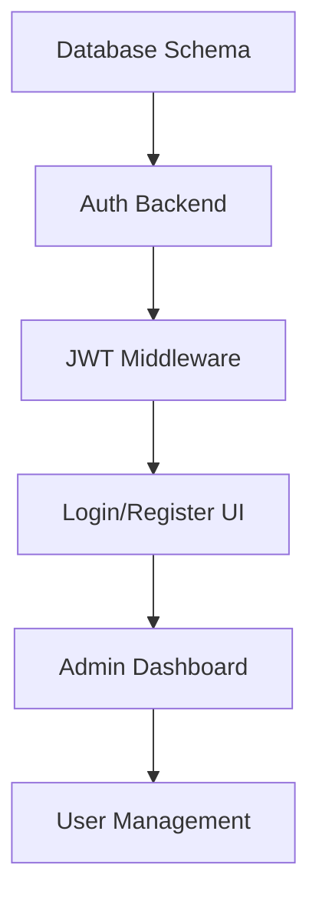

# 🗺️ **Authentication & Admin Dashboard Implementation Roadmap**

## 🎯 **Quick Start Priority Matrix**

### **🔥 Critical Path (Implement First)**


### **⚡ Fast Track Implementation (2 Weeks)**

#### **Week 1: Core Authentication**
| Day | Task | Priority | Estimated Hours |
|-----|------|----------|----------------|
| 1-2 | Database schema + User models | 🔴 Critical | 8h |
| 3-4 | Auth API endpoints (register/login) | 🔴 Critical | 12h |
| 5-6 | JWT middleware + basic security | 🔴 Critical | 8h |
| 7   | Email service setup | 🟡 Important | 4h |

#### **Week 2: UI & Admin Foundation**
| Day | Task | Priority | Estimated Hours |
|-----|------|----------|----------------|
| 1-2 | Login/Register components | 🔴 Critical | 10h |
| 3-4 | Basic admin dashboard layout | 🔴 Critical | 12h |
| 5-6 | User management CRUD | 🔴 Critical | 10h |
| 7   | Role-based access control | 🟡 Important | 6h |

---

## 🏗️ **Implementation Phases**

### **Phase 1: MVP Authentication (Week 1)**
**Goal**: Basic login/register working

**Deliverables**:
- ✅ Users can register with email/password
- ✅ Email verification required
- ✅ JWT-based login/logout
- ✅ Protected routes
- ✅ Basic user profile

**Files to Create**:
```
server/auth/authController.js
server/models/User.js  
client/src/auth/Login.jsx
client/src/auth/Register.jsx
client/src/context/AuthContext.jsx
```

### **Phase 2: Admin Dashboard (Week 2)**
**Goal**: Basic admin functionality

**Deliverables**:
- ✅ Admin can view all users
- ✅ Admin can suspend/activate users
- ✅ Admin can delete users
- ✅ Basic system statistics
- ✅ Admin-only route protection

**Files to Create**:
```
client/src/admin/AdminDashboard.jsx
client/src/admin/UsersManagement.jsx
server/admin/adminController.js
```

### **Phase 3: Enhanced Features (Week 3-4)**
**Goal**: Production-ready features

**Deliverables**:
- ✅ Role-based permissions system
- ✅ Audit logging
- ✅ Advanced user management
- ✅ System monitoring dashboard
- ✅ Content moderation tools

---

## 📊 **Feature Priority Scoring**

| Feature | Business Value | Technical Complexity | User Demand | Priority Score |
|---------|----------------|---------------------|-------------|----------------|
| Basic Auth (Login/Register) | 10 | 3 | 10 | **23** 🔴 |
| Admin User Management | 9 | 4 | 8 | **21** 🔴 |
| Role-based Access | 8 | 6 | 7 | **21** 🔴 |
| Audit Logging | 7 | 3 | 6 | **16** 🟡 |
| Email Verification | 6 | 4 | 8 | **18** 🟡 |
| User Profiles | 5 | 3 | 9 | **17** 🟡 |
| Social Features | 4 | 8 | 6 | **18** 🟢 |
| Advanced Analytics | 6 | 7 | 5 | **18** 🟢 |

**Legend**: 🔴 Critical (>20) | 🟡 Important (15-20) | 🟢 Nice-to-have (<15)

---

## 💻 **Development Environment Setup**

### **New Dependencies Needed**
```bash
# Backend
npm install bcrypt jsonwebtoken nodemailer express-rate-limit helmet express-validator

# Frontend  
npm install @mui/x-data-grid @mui/x-date-pickers recharts react-hook-form
```

### **Environment Variables to Add**
```env
# Authentication
JWT_SECRET=your-super-secret-jwt-key
JWT_REFRESH_SECRET=your-refresh-secret-key
JWT_EXPIRES_IN=15m
JWT_REFRESH_EXPIRES_IN=7d

# Email Service
EMAIL_SERVICE=gmail
EMAIL_USER=your-email@gmail.com
EMAIL_PASSWORD=your-app-password
EMAIL_FROM=TorrentStream <noreply@yourdomain.com>

# Admin
ADMIN_EMAIL=admin@yourdomain.com
ADMIN_PASSWORD=secure-admin-password
```

---

## 🎨 **UI/UX Design Specifications**

### **Authentication Pages**
- **Design System**: Material-UI components
- **Theme**: Dark mode compatible with existing app
- **Layout**: Centered forms with branded headers
- **Validation**: Real-time form validation with error states
- **Accessibility**: ARIA labels, keyboard navigation

### **Admin Dashboard**
- **Layout**: Sidebar navigation + main content area
- **Data Tables**: Sortable, filterable, paginated
- **Actions**: Bulk operations with confirmation dialogs
- **Responsive**: Mobile-friendly admin interface
- **Theming**: Admin-specific color scheme

### **Component Library**
```jsx
// Reusable admin components
<AdminLayout />
<DataTable />
<StatsCard />
<ActionButton />
<ConfirmDialog />
<BulkActions />
```

---

## 🔒 **Security Checklist**

### **Authentication Security**
- [ ] Password hashing with bcrypt (cost 12+)
- [ ] JWT tokens with short expiration
- [ ] Refresh token rotation
- [ ] Rate limiting on auth endpoints
- [ ] Account lockout after failed attempts
- [ ] Email verification required

### **Authorization Security**
- [ ] Role-based access control (RBAC)
- [ ] Permission checking middleware
- [ ] Admin route protection
- [ ] API endpoint security
- [ ] Input validation on all forms
- [ ] SQL injection prevention

### **Data Security**
- [ ] Sensitive data encryption
- [ ] Secure session management
- [ ] CSRF protection
- [ ] XSS prevention
- [ ] HTTPS enforcement
- [ ] Audit trail for admin actions

---

## 📱 **Mobile Responsiveness**

### **Authentication Flow**
- Mobile-optimized login/register forms
- Touch-friendly input fields
- Responsive validation messages
- Social login integration ready

### **Admin Dashboard**
- Collapsible sidebar for mobile
- Touch-friendly data tables
- Mobile-optimized charts
- Simplified mobile admin interface

---

## 🚀 **Performance Considerations**

### **Backend Optimizations**
- Database indexing on auth tables
- Connection pooling
- Caching for user sessions
- Optimized queries for user lists
- Background job processing

### **Frontend Optimizations**
- Code splitting for admin routes
- Lazy loading of admin components
- Memoization of expensive operations
- Virtual scrolling for large data sets
- Progressive loading of dashboards

---

## 📈 **Analytics & Monitoring**

### **User Analytics**
- Registration conversion rates
- Login success/failure rates
- User activity tracking
- Session duration analysis
- Feature usage statistics

### **Admin Analytics**
- Admin action frequency
- System health metrics
- User support metrics
- Content moderation stats
- Performance monitoring

---

## 🎯 **Success Criteria**

### **Technical Goals**
- [ ] 99.9% authentication uptime
- [ ] <200ms average API response time
- [ ] Zero security vulnerabilities
- [ ] 100% test coverage for auth
- [ ] Mobile-responsive admin interface

### **User Experience Goals**
- [ ] <30 second registration process
- [ ] Intuitive admin interface
- [ ] Self-service user management
- [ ] Clear error messages
- [ ] Accessibility compliance (WCAG 2.1)

### **Business Goals**
- [ ] Reduce support tickets by 50%
- [ ] Enable user self-service
- [ ] Improve content moderation efficiency
- [ ] Support user growth scaling
- [ ] Enable premium user features

---

## 🛠️ **Quick Implementation Commands**

```bash
# 1. Start with database schema
node scripts/create-auth-tables.js

# 2. Generate auth boilerplate
node scripts/generate-auth-scaffolding.js

# 3. Create admin user
node scripts/create-admin-user.js

# 4. Run development with auth
npm run dev:auth

# 5. Test authentication
npm run test:auth
```

---

This roadmap provides a clear, prioritized path to implementing enterprise-level authentication and admin capabilities while maintaining your excellent streaming features. 

**Ready to start implementation?** I can begin with any phase you prefer - typically starting with Phase 1 (core authentication) provides the fastest path to a working system.